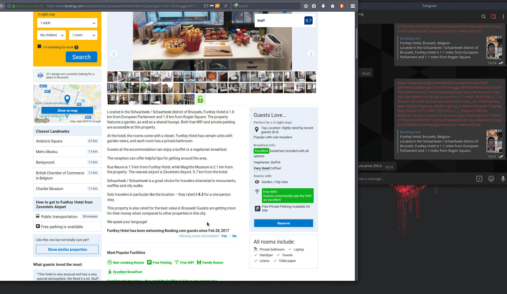

#### my old project
# booking price monitor
monitoring the price of the hotel you are interested in

## Why...?

I was interested in a specific hotel, but when I wanted to book on booking website, the price was too high and I could not find the option to be notified in case the price was dropped... seriously booking wtf? -.-

hence the idea that I would need a program to monitor their price

## Requirements

- python 3
- requests
- json
- telepot

## Usage

You need a [telegram token](https://core.telegram.org/bots#6-botfather), paste this token in the costant TELEGRAM_TOKEN

Find your bot, read [this documentation](https://telepot.readthedocs.io/en/latest/), after that simply copy a hotel url of booking website and send it to the bot via telegram chat.

## Example

